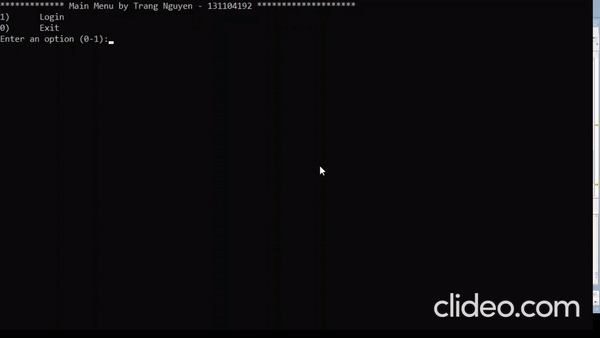

# retail-app

A simple retail application using the C++ programming language and Oracle (PL/SQL). This application allows user to login and purchase products (up to 5 products in one order). If user proceeds to checkout, the order and its details will be displayed to the screen to be confirmed and then stored in the database.

## Demo
In this demo, user login with ID1101 and purchase 02 products with ID40100 and ID40101. The order_no 333 is automatically generated by the system.


## Run project locally
Install [Visual Studio Community.](https://visualstudio.microsoft.com/vs/community/)

Install [Oracle SQL Developer.](https://www.oracle.com/ca-en/tools/downloads/sqldev-v192-downloads.html)

Install [Oracle Instant Client SDK.](https://www.oracle.com/ca-en/database/technologies/instant-client/downloads.html)
```sh
Follow the instructions in the file "Project_Setup_Connecting" of this repo to configure Oracle Instant Client.
```
Clone the repo
   ```sh
   git clone https://https://github.com/trangntt-016/retail-app
   cd retail-app
   ```


